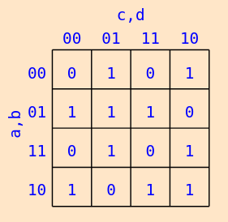

# verilog
Verilog examples and homework

Table of Contents:
1. [Finite State Machines](#fsm)

## Finite State Machines: <a name="fsm"></a>

### Sequence Generator with Next State Function
**Exercise 1:** The `next_pattern` module provides the next state function for a sequence generator. The module outputs the next state given as the input the current state. In this example, an input of `0` would produce `1`, an input of `1` would produce `3`, and so on.

Draw the state graph of the sequence. Write the state transition table, and derive the Boolean expressions from this table. Implement the `next_pattern` _with either gates or Boolean expressions._

```verilog
module next_pattern(output logic [1:0] next, input logic [1:0] cur);
    always_comb begin
        case(cur)
            0: next = 1;
            1: next = 3;
            3: next = 2;
            2: next = 0; 
        endcase      
    end
endmodule
```

Run with the professor's testbench:
```verilog
`timescale 1ns / 1ns
module main;
    parameter N = 2;
    parameter M = 2;
    logic [N-1:0] tst_vec;
    logic [M-1:0] tst_result;
    logic [M-1:0] tst_expected[(1<<N)-1:0];
    `include "apply_test_dc.v"

    next_pattern dut(tst_result, tst_vec);

    initial begin
        tst_expected[0] = 1;
        tst_expected[1] = 3;
        tst_expected[2] = 0;
        tst_expected[3] = 2;

        apply_test;
        $finish;
    end
endmodule
```

Produces the following output:
```
t=00010 tst_vec=00 tst_result=01 expecting=01
t=00020 tst_vec=01 tst_result=11 expecting=11
t=00030 tst_vec=10 tst_result=00 expecting=00
t=00040 tst_vec=11 tst_result=10 expecting=10


Test passed
```

## 4 Variable K-maps With Behavioural Verilog


